# Alk Visual Studio Code Extension

Extension for the `Alk` programming language. Right now, the following features are present:
  * Recognition of files with the `.alk` extension
  * The option to directly run files with the `.alk` extension, with different options
  * The output is interpreted, any errors created will be shown directly on the code
  * Syntax highlighting
  * Auto-update and first install of the files needed to run `Alk`

## How to use:
  * In order to run an `Alk` file, you can press the run button in the top-right menu and choose the desired option (exhaustive or not).</br>
  
  </br></br></br>
  * You can also run an `Alk` file by right clicking on the active editor and using the `Alk` submenu.<br>
  
  </br></br></br>
  * In order to stop a running program you can press the stop button in the top-right menu.<br>
  
  </br></br></br>
  * Or right click on the active editor and use the option from the `Alk` submenu.<br>
  
  </br></br></br>
  * The settings of `Alk` can be accessed using the `Alk Settings` options from the `Alk` submenu when right clicking.
  
  
  * ### Settings: 
    * The `Show Command` enables or disables showing the command used to run the algorithm in the output.
    * The `Metadata` option <em>(equivalent of using `-m` as argument in the command line)</em> enables or disables showing metadata in the output.
    * The `Precision` option <em>(equivalent of using `-p "x"`, where `"x"` is a number, as arguments in the command line)</em> sets the precision that will be used when running the algorithm.
    * The `Input` options <em>(equivalent of using `-i "x"`, where `"x"` is either the path of the input file or a string containing variable-value assignments)</em> allow the use as input of either of file or a configuration directly written in the interface. The `Input Active` option must be checked if the algorithm to be executed has an input state.
  </br></br> To create input directly from the interface first the `text` option must be choosen in `Input Mode`, and then key-value pairs can be added, removed and modified in the `Input Text` setting.</br>
  
  </br></br>    To use a file as input first the `file` option must be choosen in `Input Mode`, and then the name of the file must be entered in the `Input Path` setting.</br>
  

  ## Useful links
  Read the [reference manual](https://github.com/alk-language/java-semantics/wiki/Reference-Manual) to review the Alk syntax.
  Also consider the [Alk-by example](https://github.com/alk-language/java-semantics/wiki/Alk-by-examples) wiki to understand how Alk behaves in real-scenarios.

  If you want to also run the `Alk` interpreter from the command line, it is strongly recommended to include the folder `Linux_Mac` or `Windows` in the PATH environment variable. 
  This allows you to call the the interpreter without mentioning the path to its location.
  
  ## Set Alk in PATH system variable
  Note that in the following instructions, ```[ALK-PATH]``` is a placeholder for the actual place where `Alk` is.

  In order to find the ```[ALK-PATH]``` needed below, you can run an `Alk` program through the extension with the `Show Command` option enabled from the setting, and you will see the full path to the `alki.sh` of `alki.bat` script.
  
* Linux/Mac OS:
  ```
  export PATH=[ALK-PATH]/bin:$PATH
  ```
  Note that this will set the PATH only for the current shell. Opening another shell will not have Alk set in PATH. For the change to be persistent, use:
  ```
  echo 'PATH=[ALK-PATH]/bin:$PATH' >> ~/.bashrc
  ```
  To test if it works, the following command can be ran:
  ```
  alki.sh -h
  ```
* Windows
  * Search for ```Edit the system environment variables```
  * Open the ```System Properties``` window and press ```Environment variables...```
  * Select in the bottom grid (```System variables```) the ```Path``` variable and press ```Edit...```
  * Press ```New...```
  * For `Variable name` put `Alk`, and for `Variable value` put ```[ALK-PATH]```
  
  To test if it works, the following command can be ran:
  ```
  alki -h
  ```
<br><br>
# How to use the Alk extension

## Creating and running a simple program

*  First, you must create a file with the `.alk` extension. You can do that directly from Visual Studio Code, or from Windows Explorer.
<br><br>
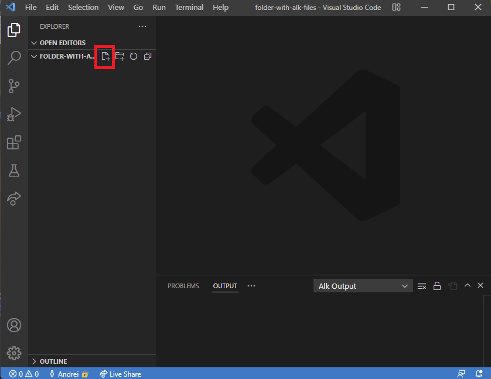
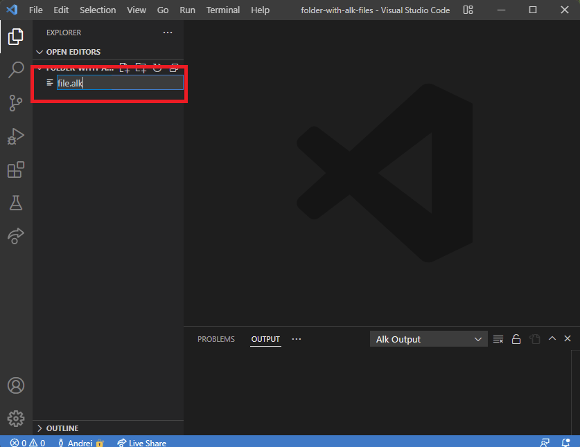
<br><br><br>
*  After creating the file, you can start typing the code for your program in it. For this example we will use a simple "Hello world" printing program.
<br><br>
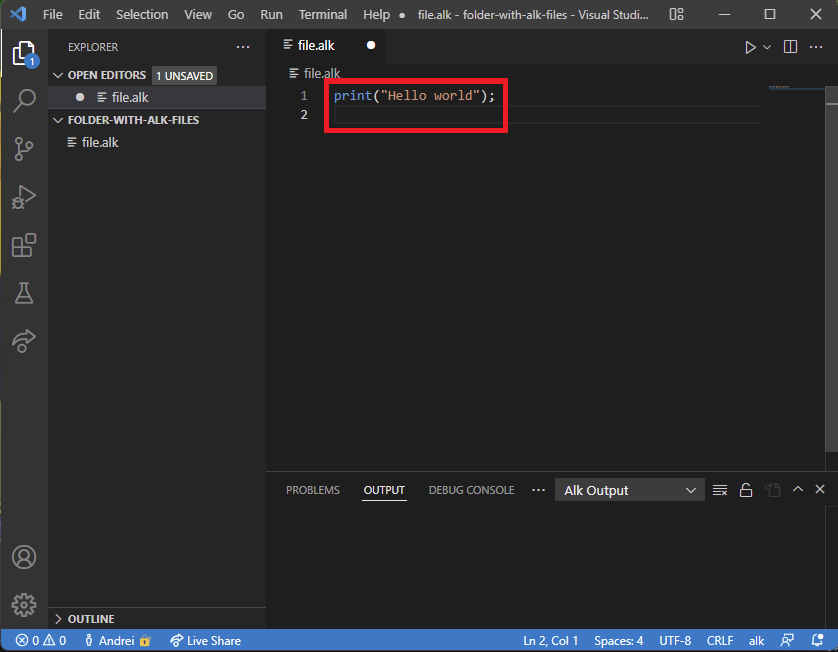
<br><br><br>
*  Now you will need to save the file. To to this you can either press `Ctrl + S` or manually go to `File -> Save` in Visual Studio Code. <strong> Any modifications made to the file will not be taken into consideration when running the program if you don't save! </strong>
<br><br>
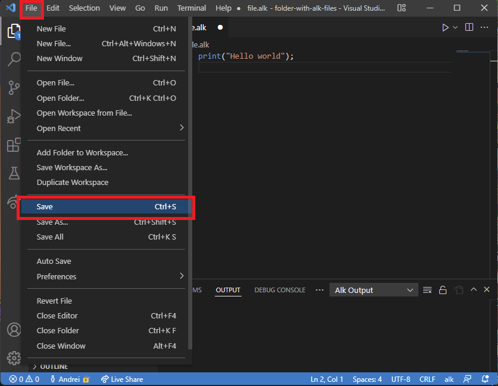
<br><br><br>
*  This program doesn't need any input, so you will need to make sure that all kinds of input are disabled in the settings. You can open the settings by right-clicking anywhere in the editor and clicking `Alk -> Alk Settings`. 
<br><br>
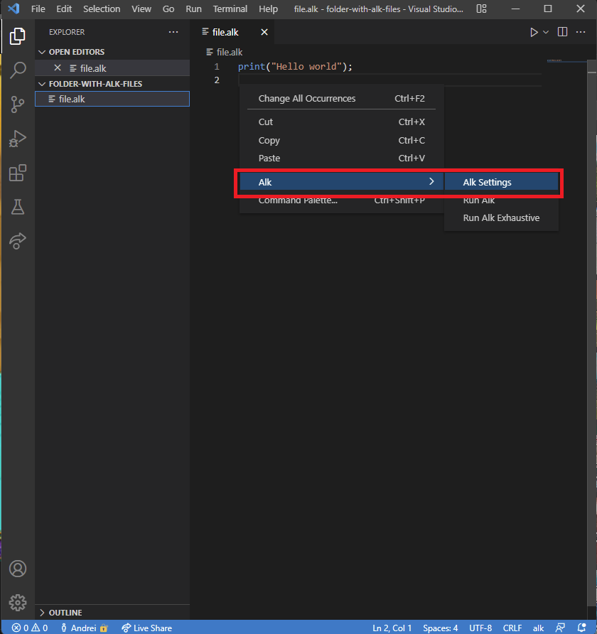
<br><br><br>
*  The settings for a program without input should look like this:
<br><br>
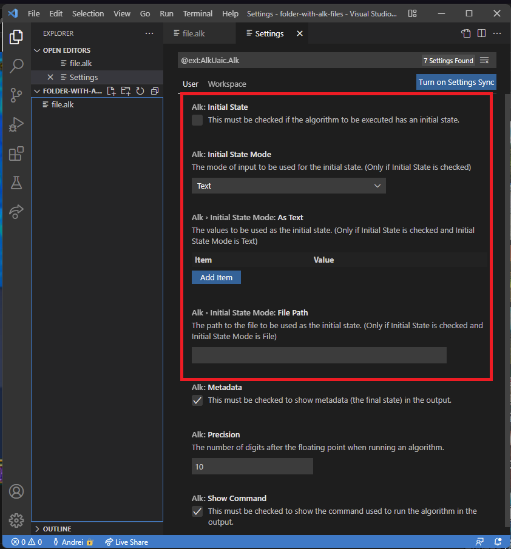
<br><br><br>
*  Now that you made sure that the settings are ok, the settings tab may now be closed and you can now run the program by right-clicking anywhere in the editor and clicking `Alk -> Run Alk`, or by clicking the run button in the top-right corner of Visual Studio Code.
<br><br>
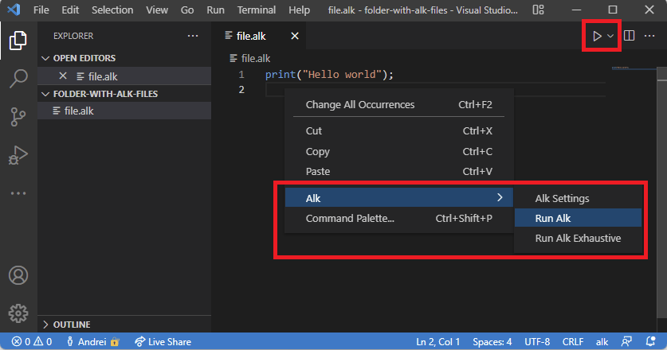
<br><br><br>

## Running a program that takes input
*  The first steps are similar to the previous example, but now a different program will be used. This program will print the sum of `a` and `b`, which will be provided from the input source. After configuring the input in the settings, running the program is the same as in the last example.
<br><br>
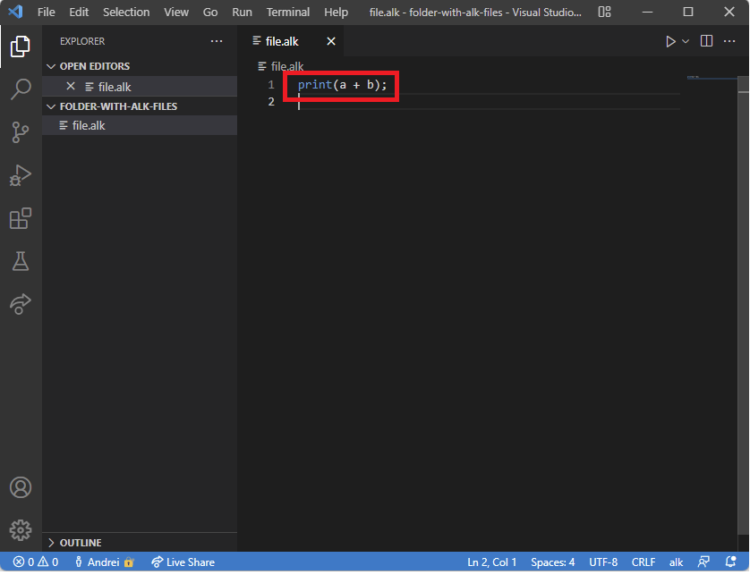
<br><br><br>
*  Now you will need to go to settigs, and enable `Initial State`
<br><br>
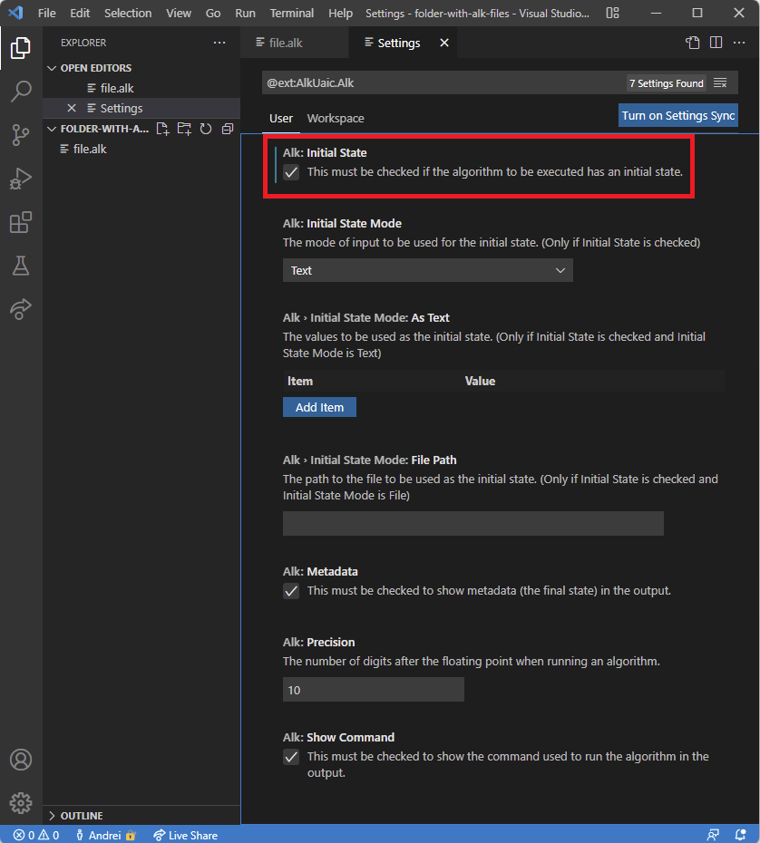
<br><br><br>
*  <em><strong>Using the input from the settings</strong></em><br>
   You will need to select `Text` for `Initial State Mode`, and you can start adding assignments in the `Initial State Mode: As Text` setting.
<br><br>
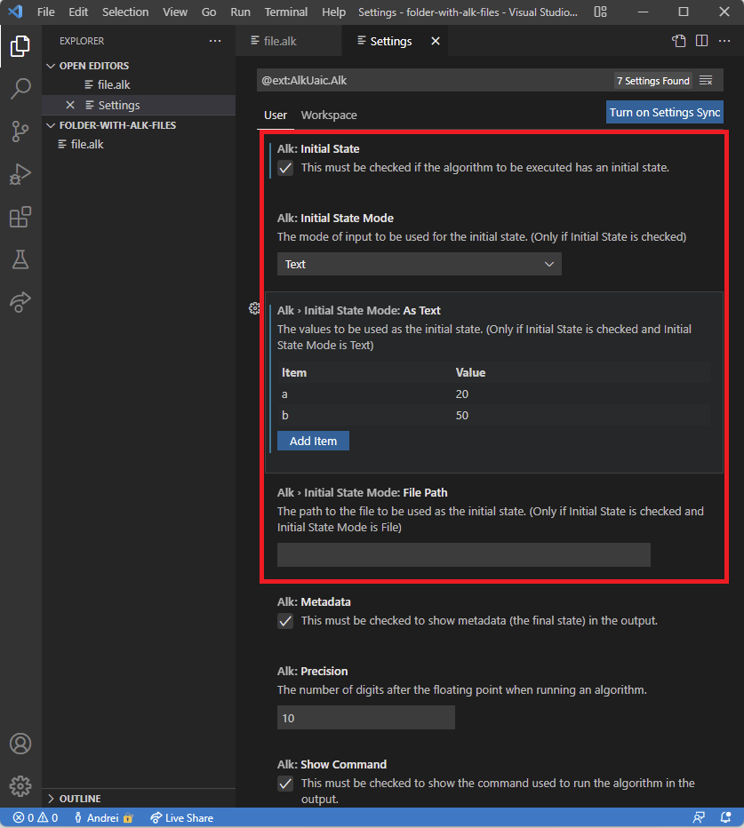
<br><br><br>
   To add a new assignment, you need to click on `Add Item`, and when you are done <strong> you need to click on `Ok` or press `Enter`</strong>.
<br><br>
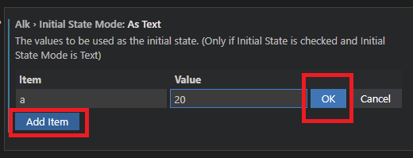
<br><br><br>
*  <em><strong>Using a file as input</strong></em><br>
   First, you will need to create an input file. For this example a file named `input.in` will be used. To create it, follow the same steps for creating a file from the first example. Inside the file, you can write all the assignments you need. After writing them, <strong> don't forget to save the file! </strong>
<br><br>
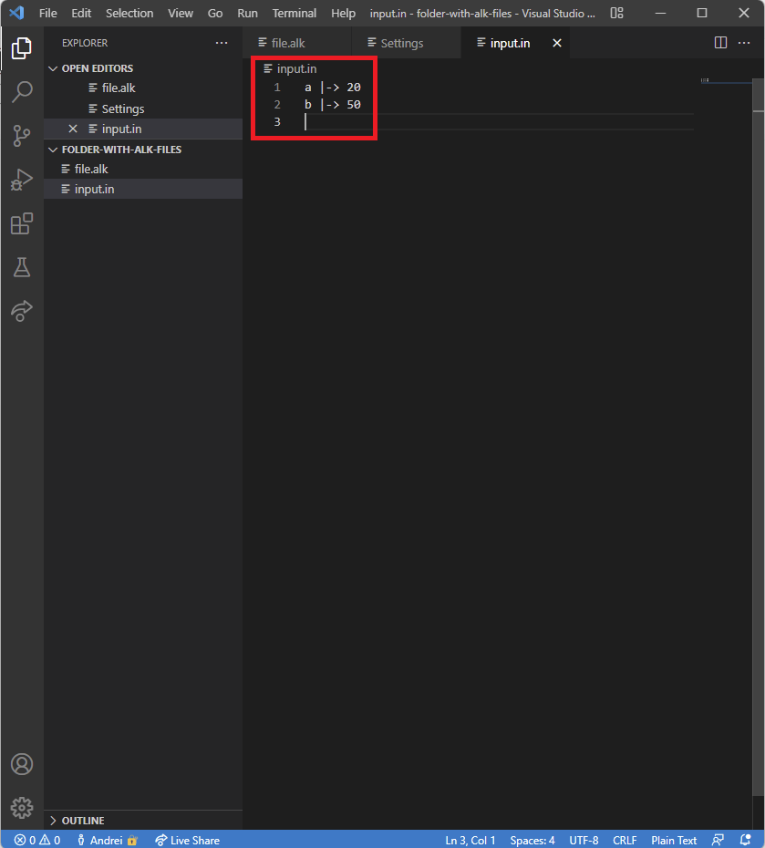
<br><br><br>
   Now you will need to select `File` for `Initial State Mode`, and input the name of the file in the `File Path` option.
<br><br>
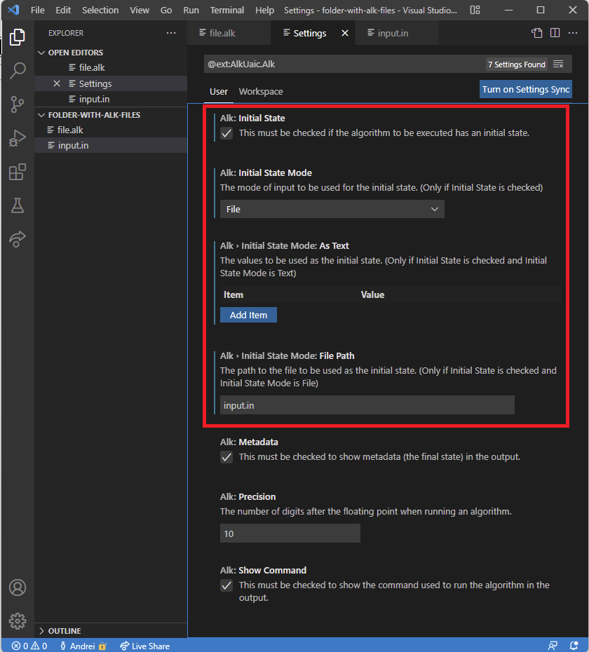
<br><br><br>
